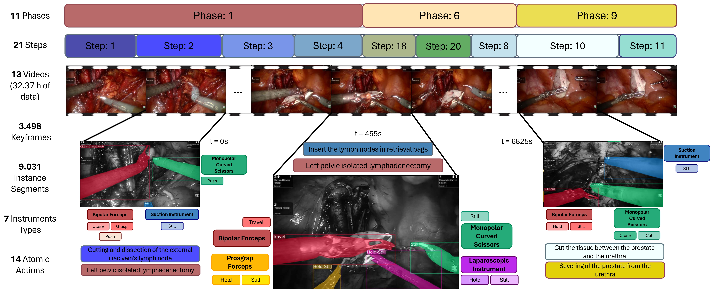

# Pixel-wise Recognition for Holistic Surgical Scene Understanding

We present the Holistic and Multi-Granular Surgical Scene Understanding of Prostatectomies (GraSP) dataset, a curated benchmark that models surgical scene understanding as a hierarchy of complementary tasks with varying levels of granularity. Our approach enables a multi-level comprehension of surgical activities, encompassing long-term tasks such as surgical phases and steps recognition and short-term tasks including surgical instrument segmentation and atomic visual actions detection. To exploit our proposed benchmark, we introduce the Transformers for Actions, Phases, Steps, and Instrument Segmentation (TAPIS) model, a general architecture that combines a global video feature extractor with localized region proposals from an instrument segmentation model to tackle the multi-granularity of our benchmark. Through extensive experimentation, we demonstrate the impact of including segmentation annotations in short-term recognition tasks, highlight the varying granularity requirements of each task, and establish TAPIS's superiority over previously proposed baselines and conventional CNN-based models. Additionally, we validate the robustness of our method across multiple public benchmarks, confirming the reliability and applicability of our dataset. This work represents a significant step forward in Endoscopic Vision, offering a novel and comprehensive framework for future research towards a holistic understanding of surgical procedures.

This repository provides instructions to download the GraSP dataset and run the PyTorch implementation of TAPIS, both presented in the paper Pixel-Wise Recognition for Holistic Surgical Scene Understanding. 

## GraSP

<div align="center">
  
</div><br/>

In this [link](http://157.253.243.19/PSI-AVA/GraSP) you will find the original Radical Prostatectomy surgical videos and annotations that compose the Holistic and Multi-Granular Surgical Scene Understanding of Prostatectomies (GraSP) dataset. The data in the link has the following organization

```tree
GraSP:
|
|--dense_frames_30fps
|         |---CASE001
|         |    |--000000000.jpg
|         |    |--000000001.jpg
|         |    |--000000002.jpg
|         |    |       ...
|         |---CASE002
|         |       ...
|         ...
|
|--frames_1fps
|         |---CASE001
|         |        |--00000.jpg
|         |        |--00001.jpg
|         |        |--00002.jpg
|         |        ...
|         |---CASE002
|         |        ...
|         ...
|
|--original_frames_1fps
|         |---CASE001
|         |        |--00000.jpg
|         |        |--00001.jpg
|         |        |--00002.jpg
|         |        ...
|         |---CASE002
|         |        ...
|         ...
|
|--annotations
          |--psiava_v2_dense_fold1.json 
          |--psiava_v2_dense_fold2.json
          |--psiava_v2_dense_test.json
          |--psiava_v2_dense_train.json
          |--psiava_v2_fold1.json 
          |--psiava_v2_fold2.json
          |--psiava_v2_test.json
          |--psiava_v2_train.json
```

## TAPIS

Go to the TAPIS directory to find our source codes for our model