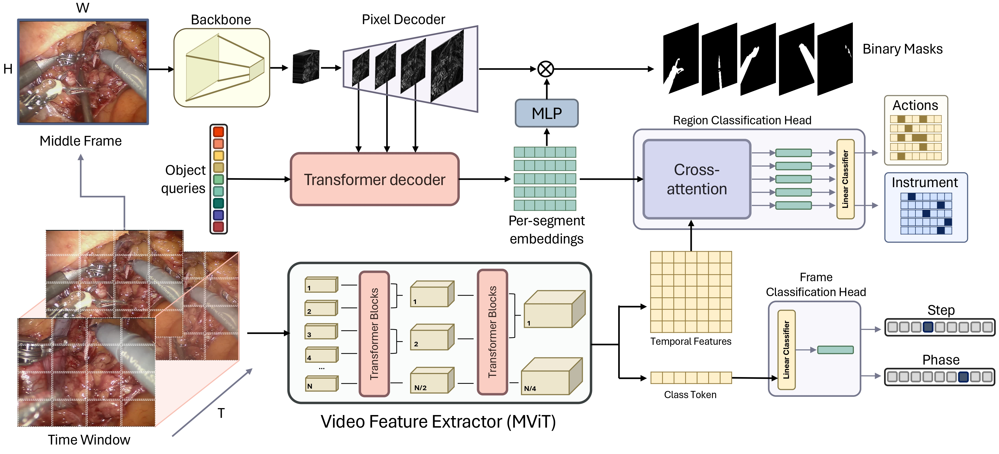

## TAPIS

<div align="center">
  
</div><br/>

### Installation
Please follow these steps to run TAPIS:

```sh
$ conda create --name tapir python=3.8 -y
$ conda activate tapis
$ conda install pytorch==1.9.0 torchvision==0.10.0 cudatoolkit=11.1 -c pytorch -c nvidia

$ conda install av -c conda-forge
$ pip install -U iopath
$ pip install -U opencv-python
$ pip install -U 'git+https://github.com/cocodataset/cocoapi.git#subdirectory=PythonAPI'
$ pip install 'git+https://github.com/facebookresearch/fvcore'
$ pip install 'git+https://github.com/facebookresearch/fairscale'
$ python -m pip install 'git+https://github.com/facebookresearch/detectron2.git'

$ git clone https://github.com/BCV-Uniandes/GraSP
$ cd GraSP/TAPIS
$ pip install -r requirements.txt
```

### Running the code

For training TAPIS in:

```sh
# the Instrument detection or Atomic Action recognition task
$ bash run_files/mvit_short_term.sh

# the Phases or Steps recognition task
$ bash run_files/mvit_long_term.sh